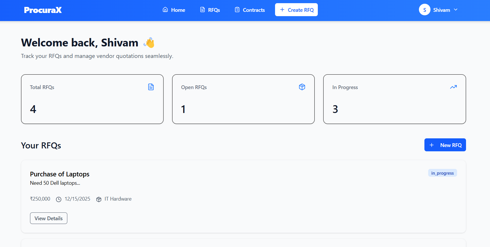
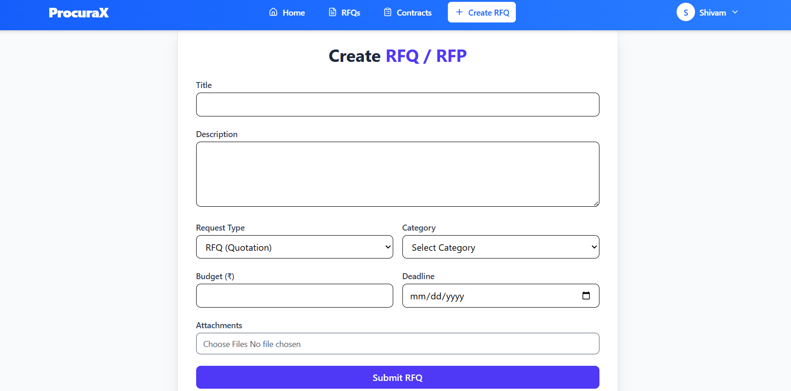
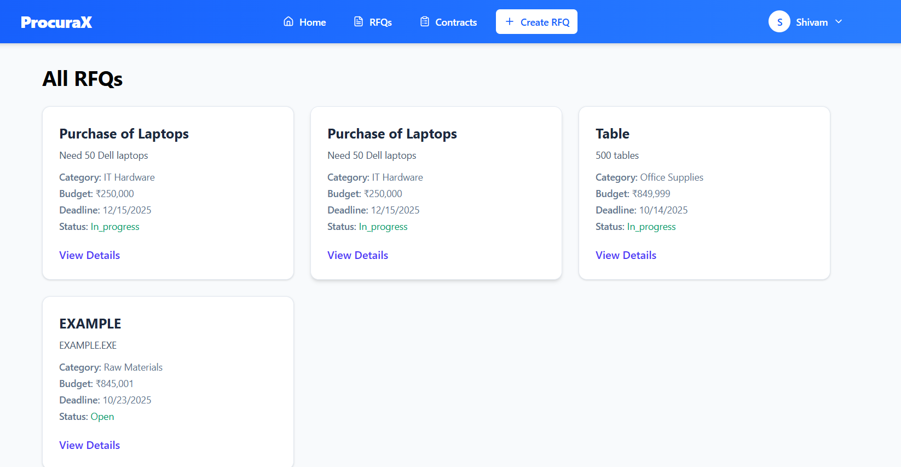
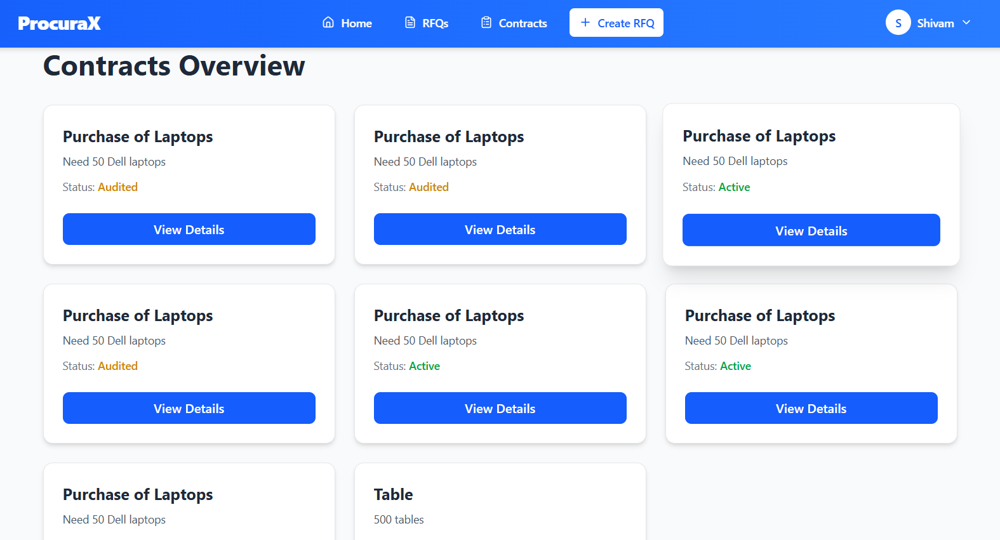

# 🏢 ProcuraX — Intelligent Procurement & Vendor Management Platform

ProcuraX is a full-stack procurement automation system designed to streamline the **Request for Quotation (RFQ)**, **Quotation Evaluation**, and **Contract Creation** process for buyers and vendors.  
The platform integrates **AI-based vendor evaluation**, **contract auditing**, and **document automation**, enabling data-driven, transparent, and efficient procurement workflows.

---

### Deployment Link : "https://procura-x.vercel.app/login"

## 📸 UI Previews

> Replace the image URLs below with your actual screenshots later.

### 🖼️ 1. Login & Signup Page


### 🖼️ 2. Buyer Dashboard (RFQ Overview)


### 🖼️ 3. Buyer RFQ/RFP Submission


### 🖼️ 4. RFQ Page


### 🖼️ 5. Contract Page

---

## 🧩 Architecture Overview

ProcuraX follows a **modular client–server architecture** with clear separation of concerns between the **React frontend** and the **Express backend**.

```

Frontend (React + Vite)
│
├── Authentication & Role-based UI
├── RFQ & Quotation Management Pages
├── Contract Creation & Audit Page
│
└── Axios API Layer → Backend (Express)
│
├── Auth Controller
├── RFQ Controller
├── Quotation Controller
├── Contract Controller
├── ML Evaluation (ONNX)
└── AI Contract Audit (Gemini API)

```

---

## ⚙️ Tech Stack

### 🖥️ Frontend
- **React + Vite** — SPA framework and fast dev environment  
- **Tailwind CSS** — utility-first styling  
- **Axios** — API integration layer  
- **React Context / Hooks** — authentication & global state  

### ⚙️ Backend
- **Node.js + Express.js** — RESTful API backend  
- **MongoDB + Mongoose** — data persistence layer  
- **JWT Authentication** — secure login and role-based access  
- **Cloudinary + Multer** — document & image upload  
- **Nodemailer** — email notifications  
- **ONNX Runtime** — machine learning model inference  
- **Gemini API** — AI-powered contract analysis  

---

## 🚀 Features

### 👤 Authentication & Role Management
- OTP-based registration & secure JWT login  
- Role-based dashboards for **Buyers**, **Vendors**, and **Admins**

### 📄 RFQ Management
- Buyers can create, update, and manage RFQs  
- Vendors can view open RFQs and respond with quotations  
- Attachments supported via Cloudinary uploads  

### 💰 Quotation Evaluation
- Automated vendor score based on:
  - Price comparison  
  - Delivery time  
  - Compliance score (ISO, material grade, etc.)  
- Vendor ranking and selection via ML model  

### 📑 Contract Creation & Audit
- Contract generation from accepted quotations  
- AI audit powered by Gemini for:
  - Risk analysis  
  - Missing clause detection  
  - Compliance warnings  
- Downloadable and editable contract PDFs  

### ✉️ Notifications & Email Alerts
- Automatic emails for key actions:
  - New RFQ posted  
  - Quotation received  
  - Quotation accepted / rejected  
  - Contract generated  

### 📊 Admin Dashboard (optional)
- Manage users, vendors, and RFQs  
- View system-wide statistics and audit reports  

---

## 🧠 ML & AI Integration

### 🤖 Vendor Evaluation Model
A custom-trained model (exported to **ONNX format**) evaluates vendors based on:
- Price deviation from median
- Delivery time
- Compliance features
- Past performance (optional)

### 🧩 Contract Audit Engine
Integrates with **Google Gemini API** to automatically analyze contract content for:
- Risk warnings  
- Clause inconsistencies  
- Missing compliance terms  

---

## 🛠️ Project Structure

```

ProcuraX/
│
├── Backend/
│   ├── controllers/
│   ├── models/
│   ├── routes/
│   ├── middlewares/
│   ├── utils/
│   └── index.js
│
├── Frontend/
│   ├── src/
│   │   ├── components/
│   │   ├── pages/
│   │   ├── api/
│   │   └── context/
│   └── vite.config.js
│
└── README.md

````

---

## ⚙️ Installation & Setup

### 🔧 Prerequisites
- Node.js ≥ 18.x  
- MongoDB (Local or Atlas)  
- Cloudinary account  
- Gemini API key (for contract audit)

### 🧩 Backend Setup
```bash
cd Backend
npm install
````

Create a `.env` file:

```bash
PORT=5000
MONGO_URI=your_mongodb_uri
JWT_SECRET=your_jwt_secret
CLOUDINARY_CLOUD_NAME=your_cloud_name
CLOUDINARY_API_KEY=your_api_key
CLOUDINARY_API_SECRET=your_api_secret
GEMINI_API_KEY=your_gemini_api_key
EMAIL_USER=your_email
EMAIL_PASS=your_email_password
```

Run backend:

```bash
npm run dev
```

### 🖥️ Frontend Setup

```bash
cd Frontend
npm install
npm run dev
```

Frontend runs on [http://localhost:5173](http://localhost:5173)

---

## 🧑‍💻 Contribution

Contributions are welcome! Follow these steps:

1. Fork this repository
2. Create a new branch (`feature/new-feature`)
3. Commit changes (`git commit -m "Added new feature"`)
4. Push branch (`git push origin feature/new-feature`)
5. Open a Pull Request


## ✨ Author

**👤 Shivam Jha**
💼 Full Stack Developer | AI Integrator | Open Source Enthusiast
📧 [shivamprofessional1@gmail.com](mailto:shivamprofessional1@gmail.com)
🌐 [GitHub Profile](https://github.com/shivammiyyy)


