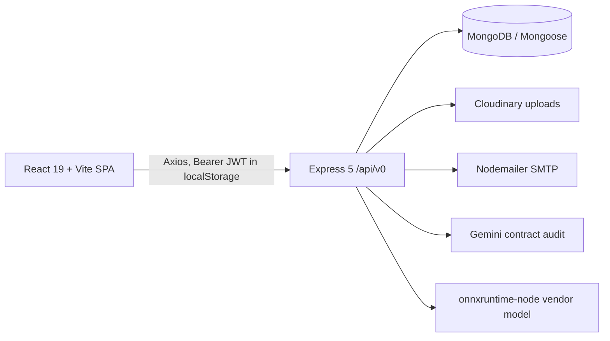

# Legacy Architecture (Node.js / Express / MongoDB)

Snapshot of the pre-V2 application. It stays in `Frontend/` and `Backend/` until each domain has a verified replacement.

## Frontend (`Frontend/`)

- React 19, Vite 7, Tailwind 4, React Router 7, Axios, Lucide, Radix-based `components/ui`. Source is JS/JSX (only `components/ui/*.tsx` and `lib/utils.ts` are TypeScript). `@reduxjs/toolkit`, `react-redux` and `framer-motion` are installed but unused.
- State: `context/AuthContext.jsx` keeps `user` and `token` in `localStorage`; no server-state cache.
- API clients (`src/api`): `axiosApi.js` (base URL `VITE_API_URL`, default `http://localhost:4000/api/v0`, injects Bearer token), `authApi`, `rfqApi`, `quotationApi`, `contractApi`.
- Auth UI: `LoginPage`, `SignupPage` with `LoginForm`, `RegisterForm`, `VerifyEmailForm` (email + OTP flow).
- Routes (`App.jsx`): `/login`, `/signup`, `/`, `/dashboard`, `/rfqs`, `/rfqs/create`, `/rfqs/:id`, `/quotations`, `/quotations/create/:rfqId`, `/quotations/:id`, `/contracts`, `/contracts/create/:quotationId`, `/contracts/:id`, `*` redirects to `/`.
- `ProtectedRoute` only checks that a token exists; its `role` prop is ignored, so role gating is not enforced in the UI (and must not be trusted anyway).
- `FileUploader` is a bare file input; uploads are sent as form data to the RFQ/quotation/contract endpoints.

## Backend (`Backend/`)

Express 5 (ESM), default port 3000 (frontend expects 4000). CORS defaults to `*` with credentials. No rate limiting is actually applied (the `rate-limiter` dependency is unused), no request validation library, generic 500 handler.

| Mount | Routes |
|---|---|
| `/api/v0/auth` | `POST register` (send OTP), `POST verify` (OTP + signup, role taken from body), `POST login`, `GET getuser` |
| `/api/v0/rfq` | `POST /` (buyer, up to 5 attachments), `GET /`, `GET/PUT/DELETE /:id`, `GET /:rfqId/quotations` |
| `/api/v0/quotation` | `POST /` (vendor), `GET /`, `GET/PUT/DELETE /:id` |
| `/api/v0/contract` | `POST /` (buyer, one file), `GET /`, `GET/PUT /:id` |

### Authentication / authorization
- OTP by email, bcrypt password, 7-day JWT (`JWT_SECRET`) in the `Authorization` header. `middleware/authMiddleware.js` (`protect`) loads the user from Mongo.
- Authorization is a per-route `authorizeRoles('buyer' | 'vendor')` helper duplicated in three route files; ownership checks live inside controllers. Roles: `buyer`, `vendor`, `admin`. No organizations, permissions or tenant isolation.

### MongoDB models
- `User`: fullName, email, password, companyName, role, isVerified, otp.
- `Rfq`: title, description, requestType (RFQ/RFP), budget, deadline, category (Office Supplies / IT Hardware / Raw Materials), status (open / in_progress / closed), `Buyer`, `attachment[]` (controller writes `attachments`).
- `Quotation`: rfq, vendor, price, deliveryTimeDays, `compliance[]` (ISO, material grade, environmental, documents), vendorScore, attachments, status (submitted / under_review / Contract_created / accepted / rejected).
- `Contract`: rfq, vendor, buyer, quotation, content, contractFile, start/end dates, status, auditStatus, auditReport, auditWarnings[].

### Business logic
- **RFQ**: buyer creates; every registered vendor is emailed; buyers see own RFQs, vendors see open ones. Accepting a quotation sets the RFQ `in_progress`.
- **Quotation**: vendor submits against an RFQ; compliance score (ISO 40, grade A+/A/B 30/20/10, environmental 20, documents 10) is computed and passed with `budget - price` and delivery days to the ONNX model. Buyer may set accepted / rejected / under_review, which emails the vendor.
- **Vendor evaluation** (`utils/complianceScore.js`): `ml_model/vendor_model.onnx`, input tensor `[1,3]` float32 named `input`; returns `null` on failure. Training notebook: `ml_model/Vendor_Evaluation_Model.ipynb`.
- **Contracts**: created from a quotation, audited by Gemini (`utils/geminiService.js`, JSON output: report, warnings with type/description/severity, status), buyer and vendor are emailed.
- **Uploads** (`middleware/upload..js`): Multer + Cloudinary storage under `procurement/*`, formats jpg/png/pdf/docx.
- **Notifications** (`utils/mailer.js`): SMTP email only; no stored notifications.

### Known defects (carry into the regression list)
- `getContractById` rejects the contract's own buyer/vendor and lets others through (inverted condition).
- Signup accepts the role from the client.
- Compliance is `JSON.parse`d in the controller while the UI/model shape differs; `compliance` truthiness checks precede the parse.
- `attachment` vs `attachments` mismatch on RFQ.
- Vendor score of `null` is stored as-is when inference fails.
- No tenant boundary, wildcard CORS, no rate limiting.
