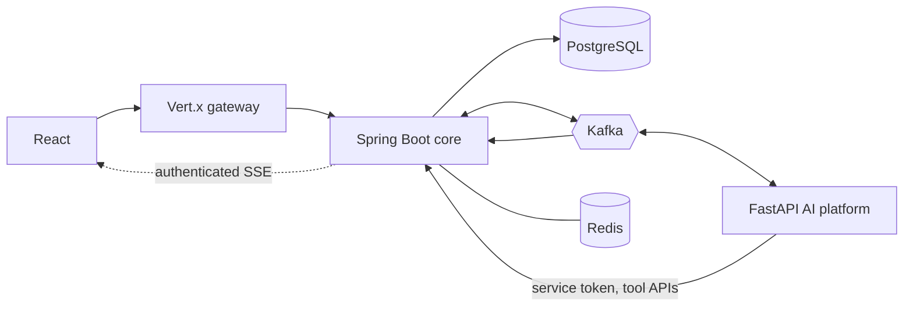

# ProcuraX V2 Migration Plan

Legacy details: [LEGACY_ARCHITECTURE.md](LEGACY_ARCHITECTURE.md).

## Status (updated each phase)

**DONE**
- Phase 1: repository analysis (`LEGACY_ARCHITECTURE.md`, this plan).
- Spring Boot 3.5 / Java 21 skeleton and `docker-compose.yml` (postgres, redis, kafka, kafka-ui, backend), verified healthy.
- Phases 2–3: package layout (`com.procurax`), standard error format, correlation-ID filter, `BaseEntity`; Flyway V1 (identity/orgs/RBAC seed), V2 (vendors, intents, RFQs, quotations, scores, contracts), V3 (outbox, processed events, audit). Verified by Testcontainers tests.
- Phase 4: Spring Security OIDC login integration, Redis-backed sessions, CSRF, explicit CORS, rate limiting, permission authorities, organization context/switching, and security tests.
- Phase 5: active organization membership validation, permission-seeded roles, tenant-derived service scope, vendor/RFQ/quotation cross-tenant repository predicates, and composite database foreign keys (`V6`).
- Phase 6 (core API slice): vendor create/read/update/member assignment; RFQ draft/create/read/update/publish/close; quotation submit/read/update/review/accept/reject; server-calculated totals and deterministic configurable vendor scoring. See `docs/PROCUREMENT.md`.
- Phase 10 (FastAPI foundation): isolated, non-root Python service with typed configuration and loopback-only Compose exposure. Health, liveness and readiness endpoints are covered by focused tests; this foundation has no database access or Kafka consumers.
- Phase 11 (procurement planner): authenticated internal API creates a tenant-attributed, deterministic RFQ draft proposal from validated user requirements. It does not mutate Spring state, infer vendor/pricing facts, or bypass human review.
- Phase 12 (vendor evaluation): FastAPI loads the existing ONNX artifact and returns tenant-attributed model advice and deterministic-factor explanations behind backend bearer authentication. The official score remains calculated by Spring and is never changed by the model.
- Phase 13 (contract intelligence foundation): authenticated, ephemeral BM25 retrieval returns cited source excerpts for five clause topics and requires human review. PDF/DOCX extraction, persistent pgvector indexing, LLM analysis and Spring orchestration remain.
- Phase 14 (purchasing policy engine): tenant-scoped, versioned policy rules support category-specific amount caps, approval thresholds, currency allowlists and minimum quote counts. Evaluation is fail-closed when no rule applies, mismatched threshold currencies require manual review, and rule/evaluation changes write audit and outbox events. This is policy eligibility only, not approval or purchase authorization.
- Phase 15 (human approvals): policy-gated requests bind to the exact accepted quotation/RFQ, snapshot the evaluation, validate an active same-organization approver, prevent self-approval, and support assigned approve/reject decisions with required rejection reasons and transactional audit/outbox events. This is a single-approver workflow; multi-step routing and notifications remain.
- Phase 16 (purchase orders): an approved, quote-bound request can issue one immutable tenant-scoped PO with a vendor and line-item snapshot. Amount and currency must match; composite tenant foreign keys, row locks and uniqueness constraints prevent cross-tenant links and duplicate issuance. Vendor delivery integrations and downstream fulfillment remain.
- Phase 17 (sandbox payments): finance-scoped, one-time PO mandates authorize the exact server-owned PO total/currency; sandbox authorization, capture and full-refund operations are idempotent, receipt-backed and audited/outboxed. No PAN, CVV, bank credentials or live processor APIs are accepted or stored. Partial refunds, provider integration and production payment compliance remain out of scope.
- Phase 18 (fulfillment/reconciliation): finance and procurement APIs record partial shipment lines and delivery exceptions, record a PO-linked invoice, and produce immutable reconciliation runs comparing invoice/PO totals, delivered item quantities and sandbox capture state/receipt. Findings are audited and emitted to the transactional outbox. Vendor webhooks, invoice documents, external bank settlement feeds and automated discrepancy resolution remain.
- Phase 19 (realtime updates): authenticated `GET /api/v1/events` streams Kafka event metadata scoped to the organization in the authenticated session and guarded by `EVENT_STREAM_READ`. Per-organization connection limits and bounded client queues are enforced; reconnect requires refetching current state.

**IN PROGRESS**
- Phase 6 follow-through: frontend API cutover and legacy-route removal. Spring supports Cloudinary-backed vendor document uploads, tenant-scoped references and one-way verification. Legacy RFQ/quotation/contract uploads remain on Node until those domains cut over. FastAPI now runs the legacy ONNX model for advisory evaluation explanations; Spring persistence and orchestration remain.
- Phase 20 (frontend migration): added a TypeScript/TanStack Query workspace shell, OIDC session entry, permission-derived navigation, organization switching, SSE-driven cache refresh, Spring-backed RFQ creation, multi-line draft editing, quotation details/review, approval decisions, PO list/detail with provenance, vendor create/edit/member assignment and document upload/verification, tenant-scoped contract draft/list/detail/document upload and short-lived signed download, human audit findings and maker-checker decisions, sandbox payment detail/receipts, and shipment/invoice/reconciliation detail views. Contract DTOs expose document metadata only; tenant and vendor membership are checked before signed Cloudinary downloads are generated. Legacy route retirement remains.
- Phases 7–8 (core delivery slice): Spring writes RFQ, quotation, vendor and vendor-document lifecycle events plus audit rows transactionally; Kafka dispatch uses row locks, capped retries, a DLT, and a consumer idempotency store. Business consumers, retries/DLT integration tests, and production Kafka hardening remain.
- Phase 9 (gateway foundation): Vert.x streams HTTP requests/responses to Spring, preserves session/CSRF cookies, replaces spoofable correlation and forwarding headers, provides an independent health endpoint, and applies bounded per-peer-IP rate limits. Authenticated Spring SSE is proxied through the gateway. Distributed quotas, TLS termination and production hardening remain.

**TODO**
- Phase 13 follow-through and Phases 18–23 (see table below; phases 6–9 and authenticated Spring-to-agent tool integration still have follow-through work).

**BLOCKERS / NOTES**
- Local JDK is 17; Java 21 modules build through Docker (`docker compose build backend gateway`).
- Default host ports may be taken; override via `.env` (`.env.example`).
- Google OAuth client credentials are needed to exercise real login (env vars only).
- The Node backend stays until each domain is replaced and verified.

## CURRENT

React (JSX) SPA → Express 5 → MongoDB, with Cloudinary, SMTP, Gemini and an ONNX model. OTP + JWT auth, no organizations, no Kafka, no events, no payments/approvals/POs.

## TARGET



| Component | Owns |
|---|---|
| Spring Boot | Business truth: auth, orgs, RBAC, vendors, RFQs, quotes, POs, approvals, policy, checkout, payments (sandbox), orders, invoices, reconciliation, audit, outbox |
| Vert.x gateway | Thin edge: routing, CORS, rate limit, correlation ID and auth propagation. No business logic |
| FastAPI | LLM/agents, planning, RAG, ML scoring, contract intelligence. Never mutates the DB; recommends, Spring validates |
| Kafka | Event backbone with outbox, retry and DLQ topics |
| PostgreSQL / Redis | Source of truth / ephemeral state |

### Repository layout
Logical boundaries follow the requested layout; Spring services are one modular deployable first.

```
Frontend/                     existing SPA, redesigned incrementally (TypeScript target)
Backend/                      legacy Node API (removed per domain)
services/procurax-platform/   Spring Boot core (packages: identity, organization, vendor, rfq, quotation,
                              purchaseorder, approval, contract, payment, order, invoice, reconciliation,
                              audit, outbox, kafka)
gateway/vertx-gateway/        Vert.x gateway
ai-platform/fastapi/          FastAPI AI platform
infra/                        kafka, postgres, redis assets
docs/
```

Folders are renamed to lowercase (`frontend/`) only at the end, because `backend/` would collide with `Backend/` on case-insensitive filesystems while the legacy code exists.

## MIGRATION STEPS

Per domain: implement in Spring → point the frontend at `/api/v1` → test (compile, tests, DB, security) → delete the Node route.

| Phase | Scope | Status |
|---|---|---|
| 1 | Repository analysis | DONE |
| 2 | Spring Boot foundation (packages, error format, correlation ID) | DONE |
| 3 | PostgreSQL + Flyway core schema (POs, approvals, policy, payments, orders, agents tables arrive in their phases) | DONE |
| 4 | Spring Security + OAuth2/OIDC (Google) | DONE |
| 5 | Organizations + RBAC + tenant isolation hardening | DONE |
| 6 | Vendor / RFQ / quotation migration (documents/frontend cutover remain) | IN PROGRESS |
| 7–8 | Kafka infrastructure, transactional outbox, idempotent consumers, retry/DLQ | IN PROGRESS |
| 9 | Vert.x gateway | IN PROGRESS |
| 10 | FastAPI platform foundation | DONE |
| 11 | Procurement planner (human-reviewed RFQ draft proposals) | DONE |
| 12 | Vendor evaluation agent and legacy ONNX advisory | DONE |
| 13 | Contract evidence retrieval (ephemeral BM25 foundation) | IN PROGRESS |
| 14 | Purchasing policy engine | DONE |
| 15 | Human approval workflows | DONE |
| 16 | Purchase orders | DONE |
| 17 | Payment sandbox and mandates | DONE |
| 18 | Fulfillment and reconciliation | DONE |
| 19 | Authenticated tenant-scoped Kafka-to-SSE event updates | DONE |
| 20 | Frontend redesign (TS, TanStack Query, Recharts) and API cutover | IN PROGRESS |
| 21–23 | Audit/observability, security + integration tests, documentation, README | TODO |

## Remaining phases

- Phase 6: frontend API cutover; migrate RFQ, quotation, and contract upload flows; migrate remaining RFQ/quotation/contract domains and retire corresponding Node routes.
- Phases 7–8: add business consumers, automated retry/DLT coverage, and harden Kafka for deployment (security, schema compatibility, operational replay and consumer retry policy).
- Phase 9: Vert.x is the HTTP gateway. Authenticated Kafka-to-SSE fan-out is implemented in Spring so organization scope comes from the authenticated session; distributed quotas, TLS/production deployment controls and full public API cutover remain.
- Phase 10: FastAPI service foundation (health/configuration/container); done.
- Phase 11: authenticated internal procurement planner returns deterministic, tenant-attributed RFQ draft proposals; done. Spring-side execution remains intentionally separate.
- Phase 12: authenticated vendor-evaluation advice with legacy ONNX inference and deterministic factor explanations; done. Persisting AI explanations alongside Spring scores and authenticated Spring-to-agent orchestration remain.
- Phase 13: add secure PDF/DOCX extraction, persisted tenant-scoped vector indexing, LLM-assisted analysis grounded in retrieved citations, Spring orchestration, and contract-domain migration. Current ephemeral lexical retrieval is only a foundation.
- Phase 14: policy engine is implemented. Flyway V11 safely disables any pre-existing amount-threshold rules until an administrator reconfigures each with an explicit currency; category-scoped rules without a match require review.
- Phase 15: basic single-approver workflow is implemented. Configurable multi-step rules and notifications remain.
- Phase 16: purchase order creation/list/detail and transactional `PURCHASE_ORDER_ISSUED` event are implemented. Vendor notification, cancellation and fulfillment remain.
- Phase 17: PO-scoped payment mandates, sandbox authorization/capture/full-refund, idempotency and receipts are implemented. Live payment provider, partial refunds and production compliance remain intentionally out of scope.
- Phase 18: partial shipments, invoice recording and immutable three-way PO/invoice/delivery/payment reconciliation are implemented. Invoices are manually recorded metadata only (no document upload or vendor submission), and settlement/bank feeds, external carrier integrations and automated exception resolution remain.
- Phase 19: Spring consumes business Kafka events and streams metadata-only SSE updates from `/api/v1/events`, scoped to the authenticated organization's session and `EVENT_STREAM_READ` permission. Connection and per-client queue limits are enforced; reconnect requires a state refetch rather than event replay.
- Phase 20: Continue the React/TypeScript frontend redesign and API cutover. The new `/workspace` uses Spring sessions, tenant switching, RBAC permissions and SSE; procurement sourcing with multi-line RFQ draft edits, quotation review, vendor management/documents, approval decisions, PO detail, contract draft/document upload/short-lived signed download/human audit/maker-checker decisions, sandbox payment details, shipment, invoice and reconciliation workflows are connected. Retire legacy pages only after replacement coverage.
- Phases 21–23: complete audit/observability, security and integration coverage, and production/developer documentation and README.

Suggested domain order for legacy removal: auth → users/orgs → vendors → RFQs → quotations → evaluation → contracts → POs → approvals → payments → orders → audit.

## RISKS

- Scope: a polyglot platform is large; each phase must compile and be tested before the next starts.
- Data migration: Mongo records have no organization; a legacy user maps to a new org during import.
- Auth cutover breaks the current login; the frontend must move to the OIDC flow in the same step the Node auth route is removed.
- AI misuse: LLM output is untrusted; all tool calls pass Spring authorization and policy.
- Payments: sandbox only, no PAN/CVV, server-computed amounts, idempotency keys.
- ONNX model: keep or port scoring; deterministic weights remain authoritative (AI only explains).
- Kafka duplicates/poison messages: mitigated by `eventId` dedupe, retry topics, DLQ.

## DEPENDENCIES

Docker; JDK 21 (via Docker); Maven; Python 3.12; Node 20; Google OAuth client; Gemini/OpenAI keys or Ollama; Kafka, PostgreSQL (pgvector), Redis images.
