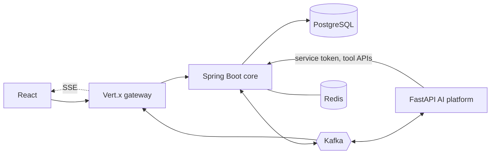

# ProcuraX V2 Migration Plan

Legacy details: [LEGACY_ARCHITECTURE.md](LEGACY_ARCHITECTURE.md).

## Status (updated each phase)

**DONE**
- Phase 1: repository analysis (`LEGACY_ARCHITECTURE.md`, this plan).
- Spring Boot 3.5 / Java 21 skeleton and `docker-compose.yml` (postgres, redis, kafka, kafka-ui, backend), verified healthy.
- Phases 2–3: package layout (`com.procurax`), standard error format, correlation-ID filter, `BaseEntity`; Flyway V1 (identity/orgs/RBAC seed), V2 (vendors, intents, RFQs, quotations, scores, contracts), V3 (outbox, processed events, audit). Verified by Testcontainers tests.
- Phase 4: Spring Security OIDC login integration, Redis-backed sessions, CSRF, explicit CORS, rate limiting, permission authorities, organization context/switching, and security tests.

**IN PROGRESS**
- Phase 5: organization/RBAC/tenant-isolation hardening as procurement services are added.

**TODO**
- Phases 6–23 (see table below).

**BLOCKERS / NOTES**
- Local JDK is 17; the Java 21 module builds through Docker (`docker compose build backend`).
- Default host ports may be taken; override via `.env` (`.env.example`).
- Google OAuth client credentials are needed to exercise real login (env vars only).
- The Node backend stays until each domain is replaced and verified.

## CURRENT

React (JSX) SPA → Express 5 → MongoDB, with Cloudinary, SMTP, Gemini and an ONNX model. OTP + JWT auth, no organizations, no Kafka, no events, no payments/approvals/POs.

## TARGET



| Component | Owns |
|---|---|
| Spring Boot | Business truth: auth, orgs, RBAC, vendors, RFQs, quotes, POs, approvals, policy, checkout, payments (sandbox), orders, invoices, reconciliation, audit, outbox |
| Vert.x gateway | Thin edge: routing, CORS, rate limit, correlation ID, auth propagation, Kafka→SSE fan-out. No business logic |
| FastAPI | LLM/agents, planning, RAG, ML scoring, contract intelligence. Never mutates the DB; recommends, Spring validates |
| Kafka | Event backbone with outbox, retry and DLQ topics |
| PostgreSQL / Redis | Source of truth / ephemeral state |

### Repository layout
Logical boundaries follow the requested layout; Spring services are one modular deployable first.

```
Frontend/                     existing SPA, redesigned incrementally (TypeScript target)
Backend/                      legacy Node API (removed per domain)
services/procurax-platform/   Spring Boot core (packages: identity, organization, vendor, rfq, quotation,
                              purchaseorder, approval, contract, payment, order, invoice, reconciliation,
                              audit, outbox, kafka)
gateway/vertx-gateway/        Vert.x gateway
ai-platform/fastapi/          FastAPI AI platform
infra/                        kafka, postgres, redis assets
docs/
```

Folders are renamed to lowercase (`frontend/`) only at the end, because `backend/` would collide with `Backend/` on case-insensitive filesystems while the legacy code exists.

## MIGRATION STEPS

Per domain: implement in Spring → point the frontend at `/api/v1` → test (compile, tests, DB, security) → delete the Node route.

| Phase | Scope | Status |
|---|---|---|
| 1 | Repository analysis | DONE |
| 2 | Spring Boot foundation (packages, error format, correlation ID) | DONE |
| 3 | PostgreSQL + Flyway core schema (POs, approvals, policy, payments, orders, agents tables arrive in their phases) | DONE |
| 4 | Spring Security + OAuth2/OIDC (Google) | DONE |
| 5 | Organizations + RBAC + tenant isolation hardening | IN PROGRESS |
| 6 | Vendor / RFQ / quotation migration | TODO |
| 7–8 | Kafka infrastructure, transactional outbox, idempotent consumers, retry/DLQ | TODO |
| 9 | Vert.x gateway | TODO |
| 10–13 | FastAPI platform, procurement agent, evaluation agent, RAG (pgvector) | TODO |
| 14–16 | Policy engine, approvals, purchase orders | TODO |
| 17–18 | Payment sandbox, fulfillment, reconciliation | TODO |
| 19–20 | SSE, frontend redesign (TS, TanStack Query, Recharts) | TODO |
| 21–23 | Audit/observability, security + integration tests, documentation, README | TODO |

Suggested domain order for legacy removal: auth → users/orgs → vendors → RFQs → quotations → evaluation → contracts → POs → approvals → payments → orders → audit.

## RISKS

- Scope: a polyglot platform is large; each phase must compile and be tested before the next starts.
- Data migration: Mongo records have no organization; a legacy user maps to a new org during import.
- Auth cutover breaks the current login; the frontend must move to the OIDC flow in the same step the Node auth route is removed.
- AI misuse: LLM output is untrusted; all tool calls pass Spring authorization and policy.
- Payments: sandbox only, no PAN/CVV, server-computed amounts, idempotency keys.
- ONNX model: keep or port scoring; deterministic weights remain authoritative (AI only explains).
- Kafka duplicates/poison messages: mitigated by `eventId` dedupe, retry topics, DLQ.

## DEPENDENCIES

Docker; JDK 21 (via Docker); Maven; Python 3.12; Node 20; Google OAuth client; Gemini/OpenAI keys or Ollama; Kafka, PostgreSQL (pgvector), Redis images.
