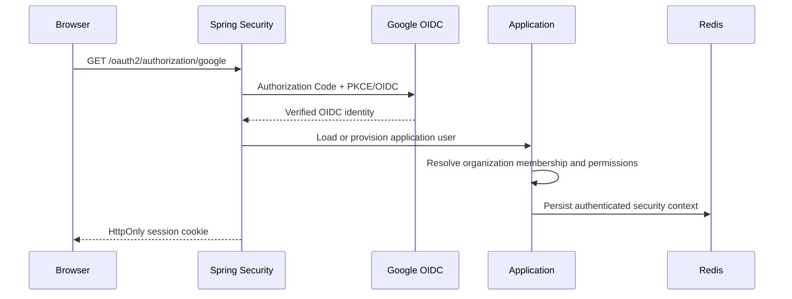

# ProcuraX Security Model

## Current migration state

The legacy `Backend/` API still uses email OTP, bcrypt and a bearer JWT. It remains available only while domains migrate. The new Spring Boot service uses server-side OAuth 2.0/OIDC sessions and does not reuse the legacy OTP/JWT model.

Google is the first configured identity provider. Provider credentials are read from `GOOGLE_CLIENT_ID` and `GOOGLE_CLIENT_SECRET`; no credentials are committed. Additional providers can be added as Spring Security client registrations without changing the application user model.

## Authentication flow



The session cookie is HttpOnly and same-site configurable. Cookie-based state-changing requests require the CSRF token issued by Spring Security. The new API does not put roles or organization IDs in frontend state as an authority source.

## Authorization

`SecurityPrincipal` contains the application user, active organization, role and server-resolved permission authorities. Controllers use permission expressions such as:

```java
@PreAuthorize("hasAuthority('PO_APPROVE')")
```

The role-to-permission mapping is seeded by Flyway in `V1__identity_tenancy_rbac.sql`. Business code should authorize permissions, not scatter role names through controllers.

On first OIDC login without a membership, the current personal-project policy provisions a private organization and assigns `ORG_ADMIN`. A production organization would normally be assigned through an invitation/admin workflow. Subsequent logins reuse existing membership; the provider's claimed role is never trusted.

## Tenant isolation

Every business table has `organization_id`. `OrganizationContext` derives the active organization from the authenticated server-side principal. Domain services must use that context when constructing repository predicates and must not use a client-provided organization ID.

Organization switching validates the target against the user's persisted `organization_members` rows before replacing the active session principal. A user who is not a member receives `403 ACCESS_DENIED`.

## Request protections

- Explicit CORS origins; wildcard CORS with credentials is not allowed.
- CSRF protection for cookie-authenticated state changes.
- Security headers: frame denial, HSTS and same-origin referrer policy.
- Redis-backed authentication endpoint rate limiting by client IP.
- Correlation IDs are generated or validated at the edge and returned in responses.
- Standard error responses do not expose stack traces.
- PostgreSQL optimistic locking is enabled on mutable domain entities.

## Service-to-service security target

FastAPI and Vert.x are not trusted to mutate business state. Future internal calls will use OAuth2 client credentials (service identities such as `ai-service` and `gateway-service`) and explicit permission scopes. Spring Boot will authenticate the service, derive organization context from the request and re-run business authorization/policy checks before any write.

## Security test coverage

The Spring module currently tests:

- unauthenticated API requests return JSON `401`;
- missing permissions return JSON `403`;
- permissions grant the expected endpoint;
- an organization ID is resolved from the authenticated principal;
- switching to a non-member organization is rejected;
- switching to a real membership succeeds;
- unverified or malformed OIDC profiles are rejected;
- role/permission seed mappings are present.

The legacy API's tenant isolation and contract authorization defects remain migration risks and are tracked in `docs/LEGACY_ARCHITECTURE.md`.
